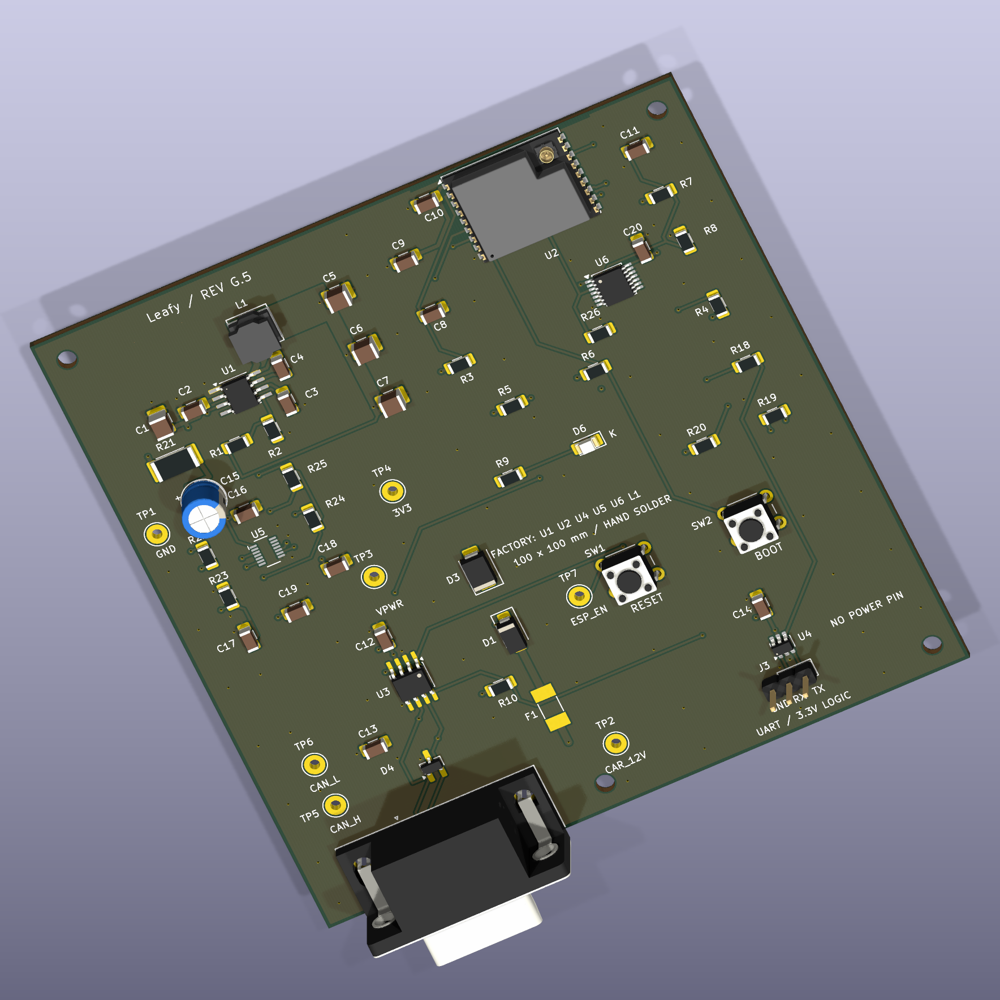

# Leafy — DIY Wi-Fi Climate Controller for Nissan Leaf

**A DIY Nissan Leaf climate On/Off controller for home Wi-Fi.**

Leafy combines a custom ESP32-C3 board, a local web page and a printable enclosure. It requests climate operation over CAN; it does not carry or switch heater power. The intended profile is the **2013–2015 Leaf EV-CAN implementation**, subject to checking the actual vehicle and TCU configuration.

**Status: untested hardware prototype, Rev G.5 prepared for manufacture.** PCB production files and final component placement have been reviewed. Firmware builds and host tests pass, but no assembled Leafy has yet demonstrated heater control in a car. CAN transmission is disabled by default.

## Start here

| Goal | Documentation |
| --- | --- |
| Understand the project | [How it works](docs/OVERVIEW.md) |
| Build one | [Build guide](docs/BUILD-GUIDE.md) |
| Understand the decisions | [Development history](docs/DEVELOPMENT-HISTORY.md) |
| Inspect the current circuit | [G.5 design](hardware/rev-g/README.md), [schematic PDF](hardware/rev-g/exports/schematic.pdf), [KiCad project](hardware/rev-g/leaf-heat-v7.kicad_pro) |
| Buy components | [Parts and costs](docs/PARTS-AND-COSTS.md) |
| Order the PCB / partial assembly | [G.5 order guide](hardware/rev-g/ORDER-G5.md) |
| Build or test firmware | [Firmware instructions](firmware/leaf-heat/README.md) |
| Print the case | [Blender and STL files](enclosure/rev-g-v2/README.md) |
| Check the evidence | [Validation status](docs/VALIDATION.md) |

## Deliberately small scope

- **Heat on / Heat off** from a browser on the same home network.
- Wi-Fi only, external antenna, no SIM, subscription or cloud service.
- One CAN channel and the specified Nissan OVMS cable pinout.
- A 100 × 100 mm, four-layer PCB with generous hand-solder spacing.
- Factory assembly of **U1/U2/U4/U5/U6/L1**; **49 other components per board** are hand-soldered and the antenna plugs in.
- Independent low-battery cutoff, input damping and protected power/CAN interfaces.

Normal operation keeps Wi-Fi associated and retries after outages. **Battery protection cuts the board's power when voltage is too low**, so it becomes unreachable until the supply recovers. Availability also depends on the router and signal. Parked current and real-world reliability still need measurement.

The commands request the vehicle's climate function, not a particular heater element or temperature setpoint. The page reports requests, not independently verified heating.

## Thanks to OVMS

Leafy was inspired by the [Open Vehicle Monitoring System (OVMS)](https://www.openvehicles.com/). Its narrow Leaf wake-up and climate-command sequence is **derived from the OVMS Nissan Leaf implementation**, pinned to revision `85074a0ae7a983b308c6e2e081185492527ee073`.

Thank you to the OVMS authors and contributors for making this work available. The original MIT notice is retained in [OVMS-NOTICE.txt](firmware/leaf-heat/OVMS-NOTICE.txt). [Credits and provenance](CREDITS.md) explain the relationship and other sources. Leafy is an independent prototype, with no claimed OVMS or Nissan endorsement.

## Repository map

- `hardware/rev-g/`: current G.5 CAD, BOMs, manufacturing files, reviews and audit tools. The internal filename `leaf-heat-v7` is intentional.
- `firmware/leaf-heat/`: ESP-IDF firmware, settings template and 25 host tests.
- `enclosure/rev-g-v2/`: Blender source, STLs, renders and G.5 compatibility. Case renders retain their G.3 artwork provenance.
- `docs/`: project history, construction, costs, validation and publication notes.
- Earlier revisions and research: development history, **not current manufacturing instructions**. Always use matching G.5 files.

The public snapshot excludes personal supplier records, credentials, configured firmware images, downloaded toolchains and unrelated projects. Originals remain local. See [publication scope](docs/PUBLICATION.md).

## Licences

See [LICENSE.md](LICENSE.md) for the project licence boundaries and retained third-party notices.
