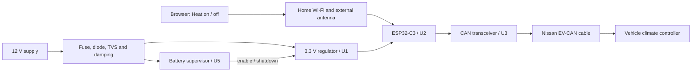

# How Leafy works

A browser on the home network sends an authenticated On/Off request to the ESP32-C3. The firmware sends the appropriate CAN sequence through the specified Nissan cable. The car must be within usable 2.4 GHz Wi-Fi range.

| Block | Role |
| --- | --- |
| U1 / L1 | Convert vehicle power to 3.3 V; exposed-pad regulator and 22 µH inductor |
| F1 / D1 / D3 / C15 / R21 | Fuse, reverse blocking, transient clamp and input damping; real transient performance remains untested |
| U2 | ESP32-C3-WROOM-02U-N4, Wi-Fi MCU with external antenna socket |
| U3 | TCAN3404DRQ1 CAN transceiver, fixed to EV-CAN; no selectable second bus or extra board termination |
| U5 | Independent low-battery cutoff, even if firmware hangs |
| U6 | Disconnects the live battery divider from the unpowered processor ADC |
| U4 / J3 | Protected 3.3 V serial programming; no on-board USB socket or power input |

Nominal cutoff/restart is about **11.67/12.68 V at VPWR after the diode**, with delays and tolerances in the design review. These are calculations, not measured battery-terminal thresholds. The antenna's 300 mm lead permits mounting outside the enclosure, on plastic inside the car; improved range is not yet measured.

The page requires a separate control key and uses ordinary HTTP on a trusted LAN. There is no cloud service, mDNS or OTA update implementation. Reserve the board's IP address in the router; do not use port forwarding. Router guest/client isolation can prevent access.

Reconnect retries are unlimited with a 30-second cap. Reboot/reconnect does not replay old On requests. CAN stays in standby while idle. The sequencer supports Off preemption, bounded transmit waits and a local 15-minute Off timer. A CAN acknowledgement is not proof that climate started. Loss of board power or bus communication can prevent Off; check the car's own timeout.

This prototype does not provide cellular access, diagnostics, charging control, door locking, temperature setting or support for every Leaf generation. No automotive, EMC, ingress or environmental qualification is claimed.
